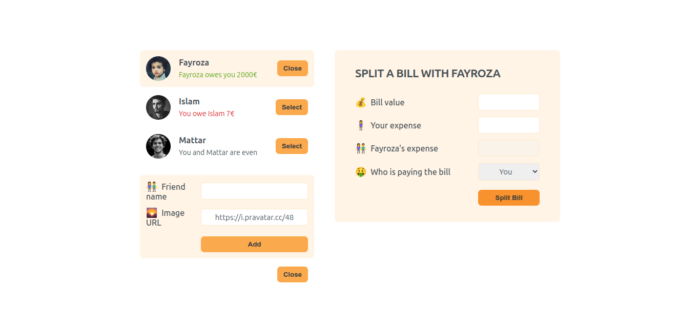

# 🍽️ Eat-N-Split

Welcome to **Eat-N-Split**! This is a fun and interactive web app designed to help you split bills with friends effortlessly. 🎉

## 📸 Screenshot



## 🌐 Live Demo

Check out the live demo of the app here: [Eat-N-Split Demo](https://eat-n-split-2193.netlify.app/)

## 🚀 Features

- **Add New Friends**: Easily add new friends to your list. 👥
- **Display Friend List**: View your friends with just a few clicks. 📜
- **Select Friends**: Choose which friends you want to split the bill with. 🔍
- **Controlled Elements**: Manage your forms and inputs with precision. 🎛️
- **Bill Splitting**: Calculate and split the bill among selected friends. 💸

## 🛠️ Technologies Used

- **React.js**: For building the user interface.
- **Node.js**: For backend logic (if applicable).
- **CSS**: For styling and layout.

## 📋 Installation

1. **Clone the repository:**

   ```bash
   git clone https://github.com/AnasHany2193/Eat-N-Split.git
   ```

2. **Navigate to the project directory:**

   ```bash
   cd Eat-N-Split
   ```

3. **Install dependencies:**

   ```bash
   npm install
   ```

4. **Start the development server:**

   ```bash
   npm start
   ```

   Your app will be running at `http://localhost:3000`.

## 🤝 Contributing

Feel free to open an issue or submit a pull request if you have suggestions or improvements. Contributions are always welcome!

## 📧 Contact

For any questions or feedback, you can reach me at [Anas Hany](https://www.linkedin.com/in/anashany219/).

---

Happy splitting! 🎉
